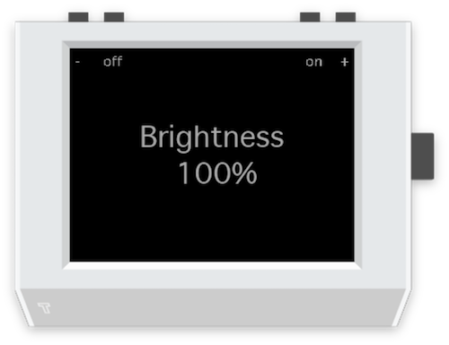

# Tingbot Screen Brightness

Sets the brightness of your [Tingbot](http://tingbot.com/) screen.

* **Right button** Increase brightness
* **Right middle button** Turn screen on
* **Left middle button** Turn screen off
* **Left button** Decrease brightness

## Installation

1. Download and install [Tide](https://github.com/tingbot/tide/releases/).
2. Download the latest version of [Screen Brightness.tingapp](https://github.com/sebflipper/tingbot-screen-brightness/archive/master.zip).
3. Open `Screen Brightness.tingapp` with Tide.
4. Run in the simulator or send to your Tingbot and open.
